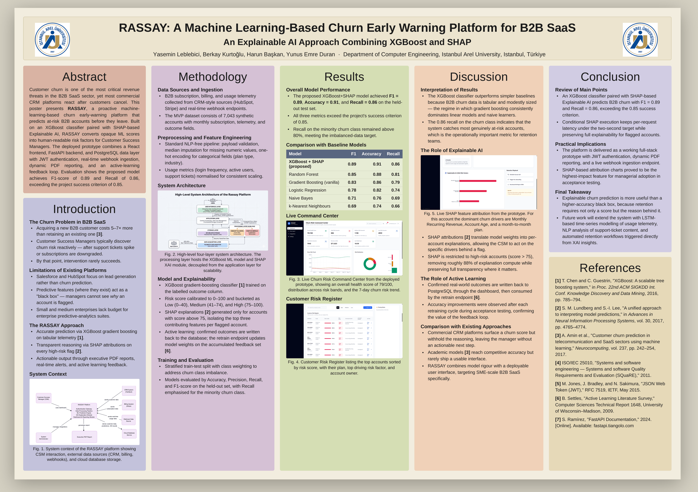

  <h1>🛡️ RASSAY</h1>

  <h3>Machine Learning-Based Churn Early Warning Platform for B2B SaaS</h3>
  <h3>B2B SaaS'lar için Makine Öğrenmesi Tabanlı Müşteri Kaybı Erken Uyarı Platformu</h3>

  
<b>Explainable AI (XAI) × XGBoost × SHAP × FastAPI × React</b>

   
 

  

 
## 🖼️ Project Poster / Proje Posteri
 

 
---
 
## 📌 Table of Contents / İçindekiler
 
- [About the Project / Proje Hakkında](#-about-the-project--proje-hakkında)
- [Why XGBoost + SHAP, not Deep Learning? / Neden Deep Learning Değil?](#-why-xgboost--shap-not-deep-learning--neden-deep-learning-değil)
- [Key Features / Öne Çıkan Özellikler](#-key-features--öne-çıkan-özellikler)
- [Tech Stack / Teknoloji Yığını](#-tech-stack--teknoloji-yığını)
- [System Architecture / Sistem Mimarisi](#-system-architecture--sistem-mimarisi)
- [Model Performance / Model Performansı](#-model-performance--model-performansı)
- [Requirements Document / Gereksinim Dokümanı](#-requirements-document--gereksinim-dokümanı)
- [Traceability Matrix / İzlenebilirlik Matrisi](#-traceability-matrix--i̇zlenebilirlik-matrisi)
- [Team / Ekip](#-team--ekip)
- [References / Kaynakça](#-references--kaynakça)
---
 
## 🎯 About the Project / Proje Hakkında
 
**🇬🇧 English**
 
**RASSAY** is a proactive, machine-learning-based **churn early-warning platform** built for B2B SaaS companies. Unlike traditional CRM tools that only react *after* a customer cancels, RASSAY continuously scores every active account (0–100) and flags at-risk customers **before** they churn — while explaining *exactly why* via Explainable AI (XAI).
 
The platform combines:
- 🌳 An **XGBoost** gradient-boosting classifier for accurate churn prediction
- 🔍 **SHAP**-based explainability for every high-risk flag
- 🔁 An **active-learning feedback loop** for continuous model improvement
- 📊 A full-stack dashboard (React + FastAPI + PostgreSQL) for Customer Success Managers (CSMs)
**🇹🇷 Türkçe**
 
**RASSAY**, B2B SaaS şirketleri için geliştirilmiş, proaktif ve makine öğrenmesi tabanlı bir **müşteri kaybı (churn) erken uyarı platformudur**. Müşteri abonelikten ayrıldıktan *sonra* tepki veren geleneksel CRM araçlarının aksine, RASSAY her aktif hesabı sürekli olarak (0–100 arası) puanlar ve riskli müşterileri kaybetmeden **önce** tespit eder — üstelik Açıklanabilir Yapay Zeka (XAI) sayesinde *tam olarak neden* riskli olduklarını da açıklar.
 
Platform şunları bir araya getirir:
- 🌳 Doğru churn tahmini için **XGBoost** gradyan artırma (gradient boosting) sınıflandırıcısı
- 🔍 Her yüksek riskli hesap için **SHAP** tabanlı açıklanabilirlik
- 🔁 Sürekli model iyileştirmesi için **aktif öğrenme (active learning) geri bildirim döngüsü**
- 📊 Müşteri Başarı Yöneticileri (CSM) için uçtan uca bir kontrol paneli (React + FastAPI + PostgreSQL)
---
 
## 🤔 Why XGBoost + SHAP, not Deep Learning? / Neden Deep Learning Değil?
 
**🇬🇧 English:** Customer churn data in B2B SaaS is **tabular, structured, and modestly sized** (thousands, not millions, of rows). In this regime, deep learning architectures add unnecessary complexity, training cost, and opacity without a meaningful accuracy gain. Gradient-boosted trees like **XGBoost** consistently outperform neural networks on tabular data of this scale, while **SHAP** gives Customer Success Managers transparent, per-account explanations — something a deep model would require extra tooling (and trust) to provide. This was a deliberate engineering trade-off, not a limitation.
 
**🇹🇷 Türkçe:** B2B SaaS ortamındaki müşteri kaybı verisi **tablo (tabular) formunda, yapılandırılmış ve orta ölçeklidir** (milyonlarca değil, binlerce satır). Bu ölçekte, derin öğrenme (deep learning) mimarileri anlamlı bir doğruluk artışı sağlamadan gereksiz karmaşıklık, eğitim maliyeti ve şeffaflık kaybı getirir. **XGBoost** gibi ağaç tabanlı (gradient boosting) modeller bu ölçekteki tablo verilerinde sinir ağlarını tutarlı biçimde geride bırakır; **SHAP** ise Müşteri Başarı Yöneticilerine hesap bazında şeffaf açıklamalar sunar — bu, bir derin öğrenme modelinde ekstra araç ve güven gerektirecek bir özelliktir. Bu tercih, bir kısıtlama değil, bilinçli bir mühendislik kararıdır.
 
---
 
## ✨ Key Features / Öne Çıkan Özellikler
 
| 🇬🇧 Feature | 🇹🇷 Özellik |
|---|---|
| 🎯 **Churn Risk Scoring (0–100)** with Low / Medium / High buckets | **Churn Risk Skorlaması (0–100)**, Düşük / Orta / Yüksek kategorileri |
| 🔍 **SHAP-based XAI** — top 3 risk factors per flagged account | **SHAP tabanlı XAI** — her riskli hesap için en önemli 3 risk faktörü |
| 🔔 **Real-time Early Warning Alerts** on risk escalation | Risk artışında **gerçek zamanlı erken uyarı bildirimleri** |
| 📄 **Dynamic Executive PDF Reports** with embedded XAI charts | Gömülü XAI grafikleriyle **dinamik yönetici PDF raporları** |
| 🔁 **Active Learning** — retrain the model from confirmed outcomes | **Aktif Öğrenme** — onaylanan gerçek sonuçlarla modeli yeniden eğitme |
| 🔐 **JWT-based Authentication** & protected routes | **JWT tabanlı kimlik doğrulama** ve korumalı rotalar |
| 🔗 **Live Webhook Ingestion** from CRM/billing systems (HubSpot, Stripe) | CRM/faturalama sistemlerinden (HubSpot, Stripe) **canlı Webhook veri alımı** |
| 🌗 **Dark Mode**, dynamic search, filtering & CSV export | **Karanlık Mod**, dinamik arama, filtreleme ve CSV dışa aktarma |
 
---
 
## 🛠️ Tech Stack / Teknoloji Yığını
 
| Layer / Katman | Technology / Teknoloji |
|---|---|
| Frontend | React.js, Vite, Tailwind CSS |
| Backend | Python, FastAPI |
| Database | PostgreSQL (Neon) |
| ML / XAI | XGBoost, SHAP, Scikit-Learn |
| Auth | JWT + bcrypt |
| Reporting | ReportLab (PDF generation) |
| Deployment | Vercel (Frontend), Render (Backend), Neon (DB), Docker |
 
---
 
## 🏗️ System Architecture / Sistem Mimarisi
 
**🇬🇧 EN:** RASSAY follows a **4-layer, decoupled architecture**:
1. **Data Acquisition Layer** — ingests B2B telemetry via scheduled APIs and real-time secure **Webhooks**
2. **Storage Layer** — PostgreSQL, with AES-256 encryption at rest
3. **Processing Layer (AI/ML/XAI)** — XGBoost scores churn risk; SHAP generates explanations **only for high-risk accounts (score > 75)**, cutting explanation compute by ~88%
4. **User Interface Layer** — the React dashboard, secured by a **JWT authentication gateway**, delivering real-time alerts, dark mode, and PDF exports
**🇹🇷 TR:** RASSAY, **4 katmanlı, ayrık (decoupled) bir mimari** izler:
1. **Veri Toplama Katmanı** — B2B telemetri verisi, zamanlanmış API'ler ve gerçek zamanlı güvenli **Webhook'lar** aracılığıyla alınır
2. **Depolama Katmanı** — AES-256 şifreleme ile PostgreSQL
3. **İşleme Katmanı (AI/ML/XAI)** — XGBoost churn riskini puanlar; SHAP açıklamaları **sadece yüksek riskli hesaplar için (skor > 75)** üretilir, bu da açıklama hesaplama maliyetini ~%88 azaltır
4. **Kullanıcı Arayüzü Katmanı** — **JWT kimlik doğrulama** ile korunan React kontrol paneli; gerçek zamanlı uyarılar, karanlık mod ve PDF dışa aktarma sunar
---
 
## 📈 Model Performance / Model Performansı
 
| Model | F1 | Accuracy | Recall |
|---|---|---|---|
| **XGBoost + SHAP (proposed / önerilen)** | **0.89** | **0.91** | **0.86** |
| Random Forest | 0.85 | 0.88 | 0.81 |
| Gradient Boosting (vanilla) | 0.83 | 0.86 | 0.79 |
| Logistic Regression | 0.78 | 0.82 | 0.74 |
| Naive Bayes | 0.71 | 0.76 | 0.69 |
| k-Nearest Neighbours | 0.69 | 0.74 | 0.66 |
 
✅ **EN:** All three key metrics exceed the project's success criterion of **0.85**.
✅ **TR:** Üç temel metrik de projenin başarı kriteri olan **0.85**'i aşmaktadır.
 
---
 
## 📄 Requirements Document / Gereksinim Dokümanı
 
**🇬🇧 EN:** The `RASSAY_READ.pdf` (Requirements Elicitation and Analysis Document) is the full technical blueprint of the platform. It defines, among others:
- A **3-tier layered architecture**: React (Presentation) → FastAPI (Logic) → PostgreSQL (Data)
- **JWT-based security**: bcrypt-hashed credentials, protected dashboard routes, encrypted transit (TLS 1.2+) and at-rest (AES-256) data
- **B2B telemetry data flow**: subscription & usage ingestion via REST APIs and secure, API-key-protected **Webhooks**, with schema validation, median imputation, and categorical encoding
- **Early-warning alert system**: automatic flagging when a risk score crosses 75, real-time dashboard notifications, and an alert state management flow (Read/Dismissed)
- Full sets of Functional / Non-Functional Requirements, Use Case Models, ER Diagrams, Class Diagrams, Activity & Sequence Diagrams, Component & Deployment Diagrams, and BDD-based Acceptance Criteria
📥 **[View the full document: RASSAY_READ.pdf](./RASSAY_READ.pdf)**
 
**🇹🇷 TR:** `RASSAY_READ.pdf` (Gereksinim Elicitasyon ve Analiz Dokümanı), platformun tam teknik planını içerir. Bu dokümanda özellikle şunlar tanımlanmıştır:
- **3 katmanlı mimari**: React (Sunum) → FastAPI (Mantık) → PostgreSQL (Veri)
- **JWT tabanlı güvenlik**: bcrypt ile hashlenmiş kimlik bilgileri, korumalı dashboard rotaları, aktarımda (TLS 1.2+) ve durağan halde (AES-256) şifrelenmiş veri
- **B2B telemetri veri akışı**: REST API'ler ve API anahtarıyla korunan güvenli **Webhook'lar** aracılığıyla abonelik ve kullanım verisi alımı; şema doğrulama, medyan ile eksik veri doldurma ve kategorik kodlama
- **Erken uyarı sistemi**: risk skoru 75'i geçtiğinde otomatik işaretleme, gerçek zamanlı dashboard bildirimleri ve uyarı durum yönetimi (Okundu/Kapatıldı)
- Fonksiyonel / Fonksiyonel Olmayan Gereksinimlerin tam setleri, Use Case Modelleri, ER Diyagramları, Sınıf Diyagramları, Aktivite & Sekans Diyagramları, Bileşen & Dağıtım Diyagramları ve BDD tabanlı Kabul Kriterleri
📥 **[Dokümanın tamamını inceleyin: RASSAY_READ.pdf](./RASSAY_READ.pdf)**
 
---
 
## 🧩 Traceability Matrix / İzlenebilirlik Matrisi
 
**🇬🇧 EN:** `RASSAY_Traceability.xlsx` is the quality-assurance backbone of the project. It contains four linked sheets:
- **Summary Dashboard** — a high-level project & compliance overview (university, team, scope)
- **Functional Traceability** — maps every Functional Requirement (e.g. `FR-SEC-01`, `FR-DOC-01`) to its elicitation source/scenario, use case, UI mockup, architecture component, API endpoint, **and** its automated or manual test case result
- **Non-Functional Traceability** — links each quality/performance target (e.g. `NFR-ST-01` Prediction Accuracy ≥ 85%, `NFR-ST-02` System Uptime ≥ 99.9%) to its architectural counterpart and verification method
- **Constraints Traceability** — verifies that mandatory technical constraints (e.g. `CON-TECH-01` FastAPI backend, `CON-TECH-03` PostgreSQL) were actually implemented, with a concrete compliance-check method for each
In short, this file proves — line by line — that every requirement is **designed, built, and tested**.
 
📊 **[View the full matrix: RASSAY_Traceability.xlsx](./RASSAY_Traceability.xlsx)**
 
**🇹🇷 TR:** `RASSAY_Traceability.xlsx`, projenin kalite güvence omurgasıdır. Birbirine bağlı dört sayfadan oluşur:
- **Summary Dashboard** — üst düzey proje ve uyumluluk özeti (üniversite, ekip, kapsam)
- **Functional Traceability** — her bir Fonksiyonel Gereksinimi (ör. `FR-SEC-01`, `FR-DOC-01`) elicitasyon kaynağı/senaryosu, use case, UI mockup'ı, mimari bileşen, API endpoint'i **ve** otomatik/manuel test sonucuyla eşleştirir
- **Non-Functional Traceability** — her kalite/performans hedefini (ör. `NFR-ST-01` Tahmin Doğruluğu ≥ %85, `NFR-ST-02` Sistem Çalışma Süresi ≥ %99.9) ilgili mimari bileşenle ve doğrulama yöntemiyle ilişkilendirir
- **Constraints Traceability** — zorunlu teknik kısıtlamaların (ör. `CON-TECH-01` FastAPI backend, `CON-TECH-03` PostgreSQL) gerçekten uygulandığını, her biri için somut bir uyumluluk kontrol yöntemiyle doğrular
Kısacası bu dosya, her gereksinimin satır satır **tasarlandığını, geliştirildiğini ve test edildiğini** kanıtlar.
 
📊 **[Matrisin tamamını inceleyin: RASSAY_Traceability.xlsx](./RASSAY_Traceability.xlsx)**
 
---
 
## 👥 Team / Ekip
 
**Istanbul Arel University — Department of Computer Engineering**
 
| Name / İsim | Role / Rol |
|---|---|
| Yasemin Leblebici | 👑 Leader / Ekip Lideri |
| Berkay Kurtoğlu | 💻 Developer / Geliştirici |
| Harun Başkan | 💻 Developer / Geliştirici |
| Yunus Emre Duran | 🧪 Tester / Test Sorumlusu |
 
---
 
## 🔗 Links / Bağlantılar
 
- 🌐 **Live Demo:** [rassay-mvp.vercel.app](https://rassay-mvp.vercel.app/)
- 💻 **GitHub Repo:** [github.com/yaseminlbc/rassay-mvp](https://github.com/yaseminlbc/rassay-mvp)
---
 
## 📚 References / Kaynakça
 
1. T. Chen and C. Guestrin, "XGBoost: A scalable tree boosting system," *Proc. 22nd ACM SIGKDD Int. Conf. Knowledge Discovery and Data Mining*, 2016.
2. S. M. Lundberg and S.-I. Lee, "A Unified Approach to Interpreting Model Predictions," *NeurIPS*, vol. 30, 2017.
3. A. Amin et al., "Customer churn prediction in telecommunication and SaaS sectors using machine learning," *Neurocomputing*, vol. 237, 2017.
4. ISO/IEC 25010, "Systems and software engineering — SQuaRE," 2011.
5. S. Ramírez, "FastAPI Documentation," 2024.
6. B. Settles, "Active Learning Literature Survey," University of Wisconsin–Madison, 2009.
---
 

**Made with 🧠 + ☕ by the RASSAY Team — 2026**
 

 
